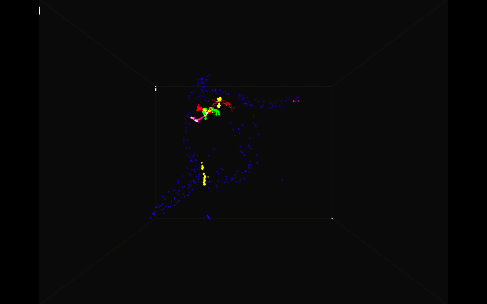

# Particles3D

Just a particles system simulator. There are n particle kinds, attracting or repulsing one each other depending
on randomly picked constants by the same general "physics" formula scheme. Interesting patterns happen to emerge.
Parameters like force formula, kind of force (local or global), number of particles, number of kinds of particles are yet in the code.

## Screenshots

